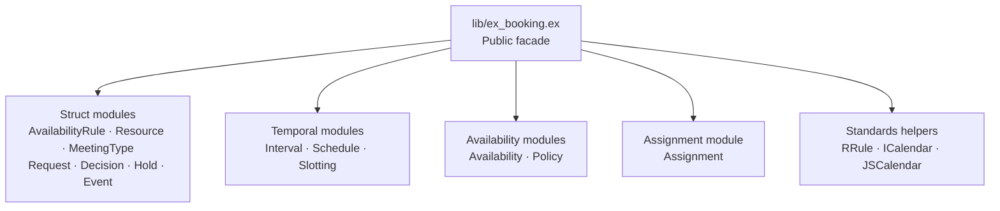
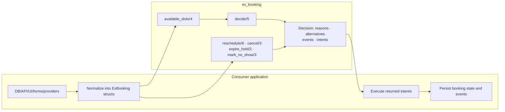
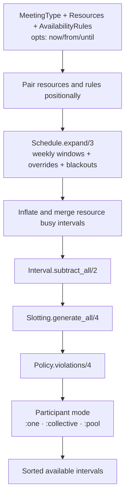
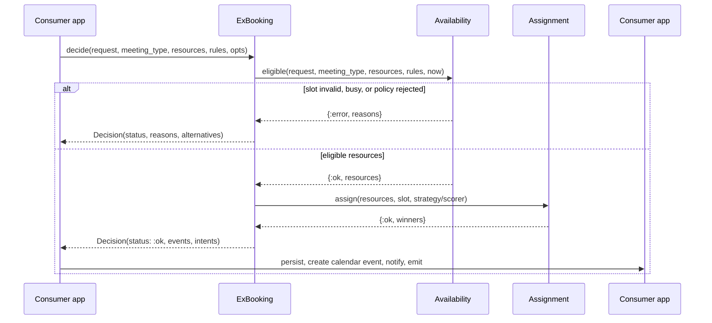
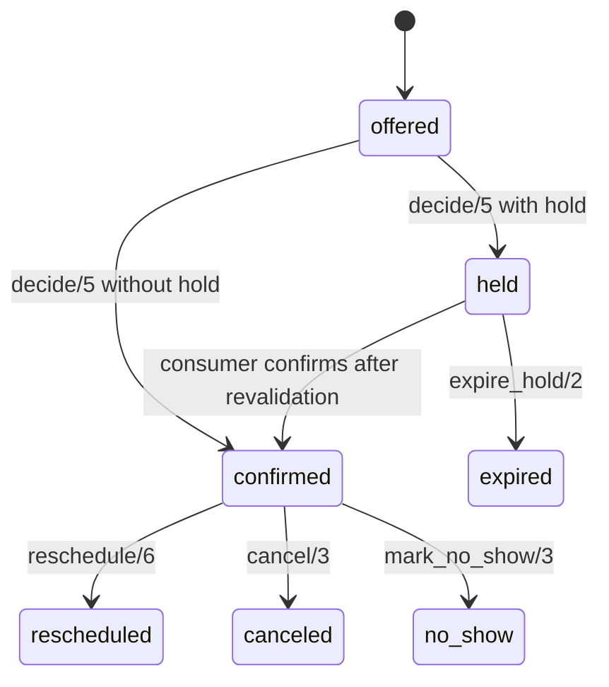
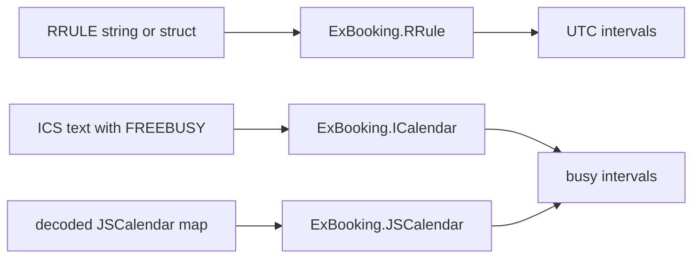

# ExBooking Docs Index

This is the entry point for understanding the `ex_booking` codebase. The repo is
a pure Elixir library: no Phoenix contexts, no Ash resources, no Ecto schemas,
no adapters, no processes, and no I/O. Consumers pass normalized data in and
execute returned intents outside this package.

## What Lives Here

## Consumer Boundary

The kernel never fetches calendars, sends notifications, captures payments,
checks auth, starts jobs, or persists data. Those responsibilities belong to
consumer repos or adapter packages.

## Availability Flow

Relevant specs:

- `docs/specs/SP.01-data-model.md`
- `docs/specs/SP.03-algorithms.md`

## Booking Decision Flow

Relevant specs:

- `docs/specs/SP.02-public-api.md`
- `docs/specs/SP.04-assignment.md`
- `docs/specs/SP.05-lifecycle-and-events.md`

## Lifecycle Flow

The consumer owns the persisted state machine. ExBooking only computes transition
facts, events, and intents.

## Standards Helpers

Relevant spec: `docs/specs/SP.06-standards-interop.md`.

## How To Continue Development

1. Read the relevant `SP.NN` spec for the module group being changed.
2. Add or update exactly one roadmap item in `docs/tasks/booking-tasks.md`.
3. Change code in the matching flat module under `lib/ex_booking/`.
4. Add module-level examples or properties under `test/`.
5. Run `mix check --no-retry` before committing.

Roadmap state belongs only in `docs/tasks/booking-tasks.md`; specs explain the
code as it exists and the contracts it must keep.

## Spec Index

- `SP.00` — kernel scope and ownership boundary.
- `SP.01` — public structs.
- `SP.02` — public facade API.
- `SP.03` — temporal availability algorithms.
- `SP.04` — assignment behavior.
- `SP.05` — lifecycle events and intents.
- `SP.06` — standards interop helpers.
- `SP.07` — validation gates and test rules.

## Research Index

- `docs/research/README.md` — research reading order and usage rules.
- `R.01` — booking-space and kernel rationale.
- `R.02` — standards interop spike.
- `R.03` — post-build kernel audit.
